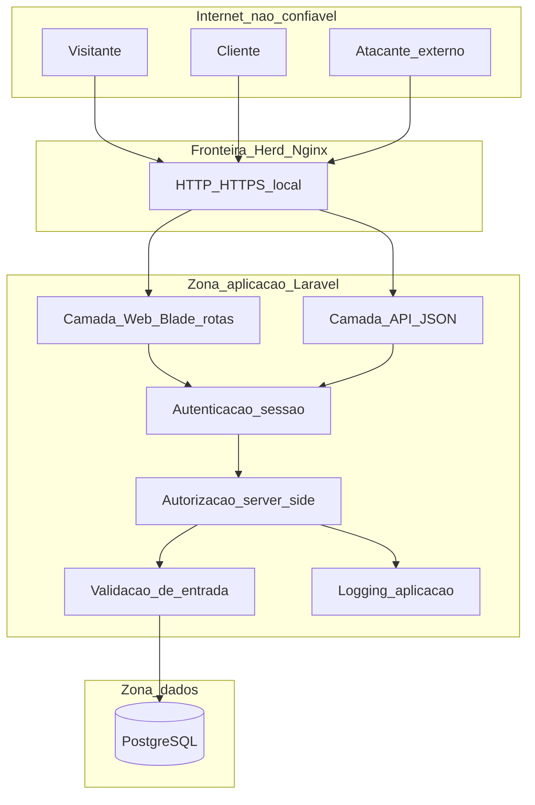

# Architecture v1 — Multiplagier

Versão inicial da arquitetura para a Sprint 0 / Security Baseline (ISG022).
Foco: caminhos relevantes para segurança, não o inventário de cada biblioteca.

## Contexto

Aplicação web de e-commerce (inspirada na Multilaser) em **Laravel 8 + PHP 8.0 + PostgreSQL**, executada localmente via **Laravel Herd**. Docker será introduzido em Sprint futura para padronizar o ambiente entre integrantes.

## Diagrama (visão lógica)

## Componentes

| Componente | Responsabilidade | Observação de segurança |
|------------|------------------|-------------------------|
| Browser / cliente HTTP | UI e chamadas HTTP | Não é fonte de decisão de autorização |
| Herd (Nginx) + PHP 8.0 | Serve a aplicação Laravel | Fronteira entre Internet e app |
| Laravel Web | Páginas do catálogo, carrinho, conta | CSRF, sessão, escape de saída |
| Laravel API (futuro) | Integrações / JSON | Auth, rate limit, validação |
| PostgreSQL | Persistência de usuários, produtos, pedidos | Credenciais fora do Git; least privilege no DB |

## Fronteiras de confiança

1. **Internet → Aplicação:** tudo que chega via HTTP é não confiável até validação.
2. **Aplicação → Banco:** apenas o backend acessa o PostgreSQL; o cliente nunca fala com o DB.
3. **Cliente autenticado ≠ Admin:** papéis distintos; checagem sempre no servidor.
4. **Frontend ≠ autoridade:** ocultar botão no Blade/JS não substitui policy/middleware.

## Controles arquiteturais planejados (não todos implementados na Sprint 0)

- Autenticação de sessão (Laravel) para Cliente e Admin
- Autorização por papel e por recurso (ex.: pedido só do dono)
- Validação de entrada (Form Requests)
- Proteção CSRF em rotas web
- Segredos apenas em `.env` (não versionados)
- Logging de eventos relevantes sem dados sensíveis em claro
- Fail secure: falha de auth/autorização → negar acesso

## Fluxos principais (alto nível)

1. **Catálogo (público):** Visitante → Web → leitura de produtos no PostgreSQL.
2. **Compra (cliente):** Cliente autentica → carrinho/pedido → AuthZ confirma dono do recurso → persistência.
3. **Admin:** Administrador autentica → middleware de papel → CRUD de catálogo/pedidos.

## Premissas e evolução

- Ambiente atual: máquina local do Tech Lead (Herd + PostgreSQL).
- Próximo passo de infraestrutura: **dockerizar** app + PostgreSQL para Marco e Mauro.
- Threat model formal detalhado na Sprint 2; este diagrama é o ponto de partida.
